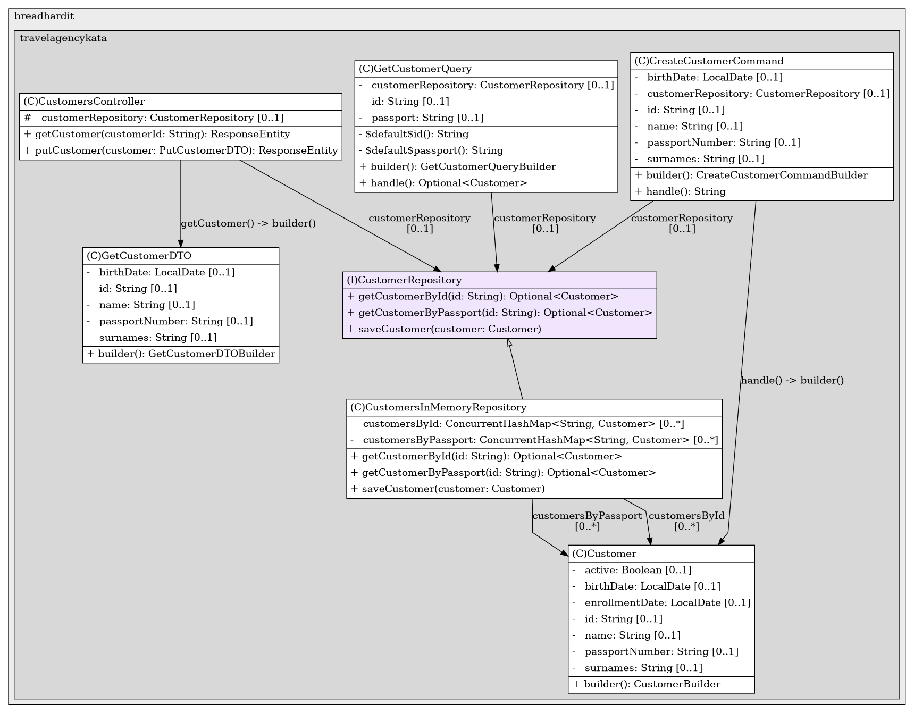
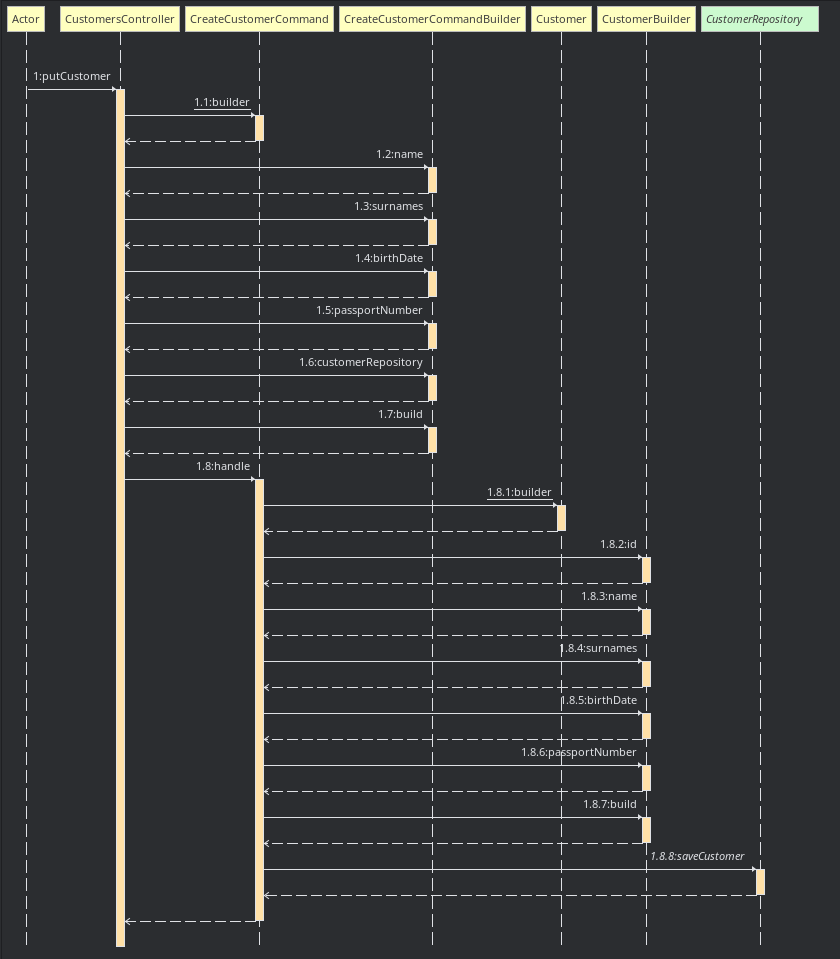
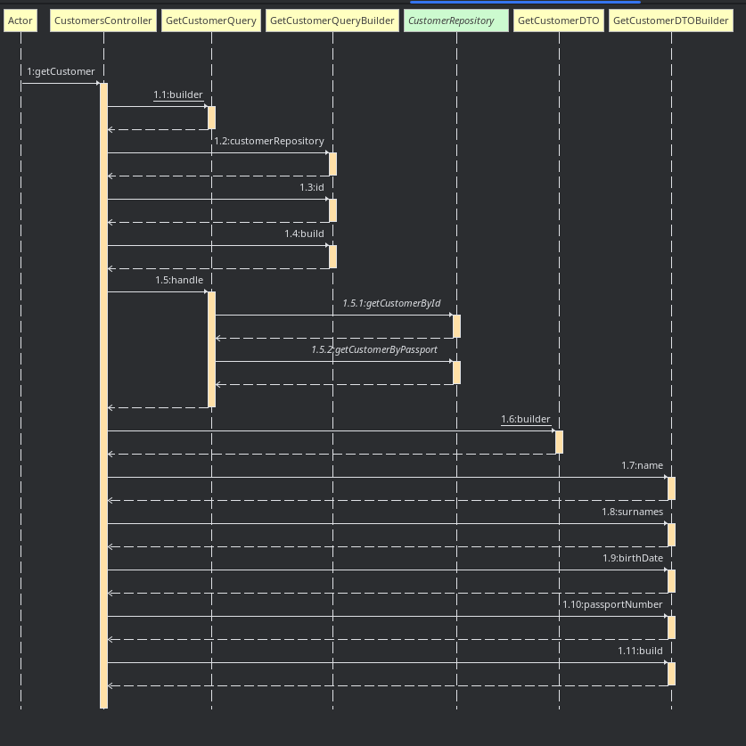

# TRAVEL AGENCY KATA

## Descripción de la tarea y contexto previo

Tenemos una pequeña aplicación que gestiona una agencia de viajes. Estamos trabajando en SCRUM, y el pasado sprint
presentamos la funcionalidad de crear un usuario y consultarlo por su identificador.

Sin embargo, nuestro cliente todavía estaba debatiendo con nuestro arquitecto que tecnología va a utilizar
para almacenar clientes. El pasado sprint, el cliente todavía no había aceptado la arquitectura propuesta.

Entre otras cosas se estaba debatiendo que base de datos utilizar. Las opciones que se planteaban eran:

- Una base de datos PostgreSQL alojada en la nube
- Una base de datos MongoDB también alojada en la nube
- Un excel (a los Managers les encanta usar excel)

Finalmente, justo antes de la sprint-planning, nos han indicado que se va a utilizar una base de datos Postgres
alojada en la nube, pero que esta situación podría cambiar la semana que viene.

## Solución diseñada

Para dar respuesta ágil a los posibles cambios, se ha optado por desarrollar el proyecto haciendo uso
de la arquitectura hexagonal. 

Sin entrar en detalles, la arquitectura hexagonal permite aislar todas las funciones lógicas de negocio
de la infraestructura en la que se implementan. Por ejemplo, el servicio que crea usuarios, no sabe en qué 
base de datos se guardan. Todo ello se realiza separando el código en 3 capas:

- Domain: contiene los objetos de valor del negocio, y la lógica más interna.
- Application: desarrolla los casos de uso. Sería el equivalente a la capa de servicing del modelo de 3 capas.
- Infrastructure: implemente la infraestructura físicas (bases de datos, controladores rest, consumidores de eventos...)

Para profundizar más, info [aquí](https://docs.aws.amazon.com/prescriptive-guidance/latest/cloud-design-patterns/hexagonal-architecture.html)

## Descripción técnica de la situación

El proyecto consta de las siguientes capas:

- Domain:
  - Contiene los objetos de valor, y la lógica más interna. Contiene las siguientes clases:
    - Customer: representa los datos del cliente
- Application:
  - Contiene los puertos que para interactuar con la infraestructura (un puerto es una capa de abstracción, normalmente una interfaz)
  - Contiene los comandos y las consultas 
- Infrastructure:
  - Contiene la implementación de la infraestructura:
    - Los controladores para la API rest y sus DTO's
    - Los repositorios 
    - Y de momento nada más, ya que no hay más infraestructura, pero podría contener consumidores de Kafka, gestión de archivos, llamadas a otras API's, etc.

Se muestra el diagrama de clases:



Se muestran los diagrams de secuencia de la creación de un cliente:





## Descripción del cambio solicitado

Lo que se requiere es modificar el microservicio actual para que en lugar de utilizar un repositorio en memoria, 
utilize una base de datos relacional PostgreSQL. Para evitar problemas de dependencia, y centrarnos en la tarea,
se proporciona lo siguiente:

- Una base de datos H2 embedida configurada para emular PostgreSQL. Esta base de datos arranca cuando arranca la aplicación.
- Las clases e interfaces que el ORM Spring Data JPA requiere para interactuar con la base de datos:
  - [CustomerEntity](src/main/java/com/breadhardit/travelagencykata/infrastructure/persistence/entity/CustomerEntity.java)
  - [CustomersJPARepository](src/main/java/com/breadhardit/travelagencykata/infrastructure/persistence/repository/CustomersJPARepository.java)

La interfaz CustomersJPAPRepository es la que interactúa con la base de datos.

## Y por fin, descripción de la tarea

Como se podrá comprobar al observar las clases, el Port [CustomersRepository](src/main/java/com/breadhardit/travelagencykata/infrastructure/persistence/entity/CustomerEntity.java) 
no encaja con la interfaz [CustomersJPARepository](src/main/java/com/breadhardit/travelagencykata/infrastructure/persistence/repository/CustomersJPARepository.java) 
así que para que encaje, tendremos que aplicar un patrón de diseño... pero, cúal?

Aprovechando que estamos tocando el código, vamos a comprobar si hay algún punto que viole alguno
de los principios SOLID. Y si es así, lo vamos a corregir.

Y ya por último, observa bien el código, en él se pueden ver algunos de los principios SOLID y patrones que 
hemos estudiado. Crea un archivo RESPONSE.md en la raíz del proyecto e indica:

- Qué principios SOLID se han utilizado para codificar este proyecto e indica algún ejemplo
- Qué patrones de diseño has observado e indica algún ejemplo

En resumen:

- Codifica el cambio solicitado
- Crea el fichero RESPONSE.md indicando principios SOLID y patrones que has observado en este proyecto
- Analiza el código del proyecto y refactoriza las clases que no cumplan SOLID


## Requisitos de la tarea

- Usamos Arquitectura Hexagonal para, precisamente, evitar realizar cambios en la capa Application y Domain cuando haya cambios en la Infrastructure, por lo que no puedes modificar dicha capa
- Las interfaces de JPA son lentejas, no se pueden modificar (excepto en casos concretos y de forma concreta), por lo que tampoco la puedes modificar
- La aplicación tiene test, estos deben seguir funcionando

## Pistas y consejos

- Hay un montón de anotaciones en el código. La mayoría son de Lombok. Si no lo conoces, es una librería superútil que te ayudará
a desarrollar más rápido. Se encarga de crear, en tiempo de compilación, un montón de código que no nos aporta codificar: 
constructores, getters, setters, toString, definición de Logger's, etc. Instálate el plugin de Lombok para tu IDE y verás como ocurre la magia.
- En spring se utiliza la inyección de dependencias. Sin entrar en detalles, aquellas clases que queramos que se inyecten
según spring crea que se necesiten, se inyectan con las anotaciones correspondientes. Si creas una nueva clase que pienses que 
se debe inyectar (un servicio, un repositorio, etc.) acuérdate de anotarla con la anotación correspondiente.
- No te líes en intentar entender como se arranca la base de datos y se crean las tablas. Es magia xD. Si tienes curiosidad
sobre el tema, me puedes enviar un correo, y te lo explico.

## Definition of Done

- Los clientes se almacenan y se recuperan de la base de datos
- Los test siguen funcionando correctamente

## Cómo entregar la tarea?

- Haz un fork de este repositorio con el nombre travel-agency-kata-<tu-nombre-y-apellidos>. [más info](https://docs.github.com/es/pull-requests/collaborating-with-pull-requests/working-with-forks/fork-a-repo)
- Clona en tu repositorio forkeado
- Configura el upstream de tu repositorio local contra el repositorio original [https://github.com/breadhardIT/travel-agency-kata]() o [git@github.com:breadhardIT/travel-agency-kata.git]() si usas SSH
- Crea una nueva rama: ```git checkout -b feature/add-jpa-persistence```
- Realiza los commits y push necesários
- Crea una Pull Request en GitHub. [Aquí tienes un tutorial](https://docs.github.com/en/pull-requests/collaborating-with-pull-requests/proposing-changes-to-your-work-with-pull-requests/creating-a-pull-request-from-a-fork)


